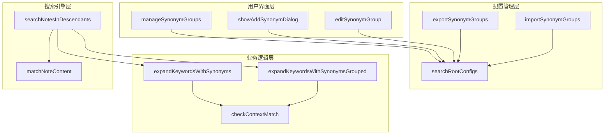
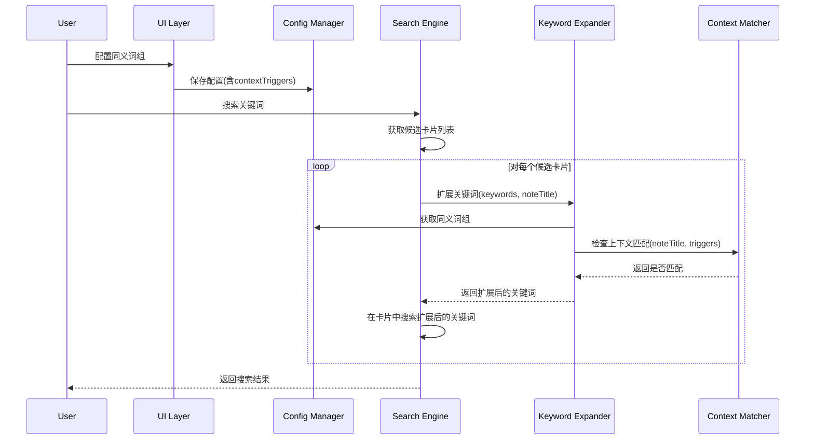
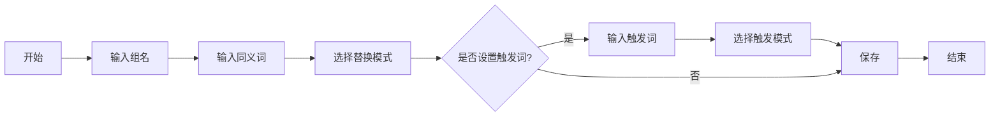

# 上下文相关同义词替换功能 - 技术设计文档

## Overview

### 设计目标
本设计旨在为 MNMath 搜索系统增加上下文感知的同义词替换能力，通过在同义词组中添加可选的上下文触发词配置，实现基于卡片标题的智能同义词匹配。设计遵循以下原则：

1. **最小侵入性**：尽可能利用现有代码结构，避免大规模重构
2. **向后兼容**：保证现有同义词配置和功能完全正常工作
3. **性能优化**：通过合理的算法和缓存策略控制性能影响在10%以内
4. **用户友好**：UI 交互保持一致性，配置直观易懂

### 设计方案概述
通过扩展现有同义词组数据结构，添加 `contextTriggers` 和 `contextMode` 两个可选字段，在关键词扩展时根据当前处理的卡片标题动态决定是否应用该同义词组。

## Architecture

### 系统架构图



### 数据流图



## Code Reuse Analysis

### 现有代码复用机会

基于对 xdyyutils.js 的分析，以下现有功能可以直接复用：

1. **配置管理基础设施**
   - `getSynonymGroups()` - 获取同义词组配置
   - `saveSearchConfig()` - 保存配置到持久化存储
   - `initSearchConfig()` - 初始化配置
   - `searchRootConfigs` - 配置数据结构

2. **UI 交互组件**
   - `UIAlertView` - 对话框组件
   - `MNUtil.userSelect()` - 用户选择界面
   - `MNUtil.showHUD()` - 提示信息显示

3. **工具方法**
   - `parseWords()` - 智能解析输入的词汇
   - `MNUtil.copy()` - 复制到剪贴板
   - `MNUtil.log()` - 日志记录

### 需要修改的现有方法

1. **expandKeywordsWithSynonymsGrouped** (第 8904-8951 行)
   - 当前使用大小写不敏感匹配：`word.toLowerCase() === keyword.toLowerCase()`
   - 需要添加上下文检查逻辑
   - 需要接受可选的标题参数

2. **expandKeywordsWithSynonyms** (第 8953-8985 行)
   - 类似的修改需求
   - 保持向后兼容的接口

3. **manageSynonymGroups** (第 11426-11481 行)
   - 需要在列表显示中添加上下文配置指示
   - 调整编辑界面调用

## Detailed Design

### 数据结构设计

#### 1. 同义词组结构扩展

```javascript
// 现有结构
{
  id: "group_1234567890",
  name: "数学向量术语",
  words: ["元素", "向量"],
  enabled: true,
  partialReplacement: false,
  createdAt: 1705500000000,
  updatedAt: 1705500000000
}

// 扩展后的结构
{
  id: "group_1234567890",
  name: "数学向量术语",
  words: ["元素", "向量"],
  enabled: true,
  partialReplacement: false,
  // 新增字段
  contextTriggers: ["内积空间", "赋范线性空间", "Hilbert空间"], // 可选
  contextMode: "any", // 可选，默认 "any"，可选值："any" | "all"
  caseSensitive: true, // 可选，默认 false（保持向后兼容）
  createdAt: 1705500000000,
  updatedAt: 1705500000000
}
```

#### 2. 字段说明

- **contextTriggers** (Array<string>，可选)
  - 上下文触发词数组
  - 未定义或空数组时，同义词组按全局模式工作
  - 大小写敏感匹配
  
- **contextMode** (string，可选)
  - 触发词匹配模式
  - "any"：标题包含任一触发词即应用（默认）
  - "all"：标题必须包含所有触发词才应用

- **caseSensitive** (boolean，可选)
  - 同义词匹配是否大小写敏感
  - true：大小写敏感匹配
  - false：大小写不敏感匹配（默认，保持向后兼容）

### 核心算法设计

#### 1. 上下文匹配算法

```javascript
/**
 * 检查标题是否满足上下文触发条件
 * @param {string} title - 卡片标题
 * @param {Array<string>} triggers - 触发词数组
 * @param {string} mode - 匹配模式 "any" | "all"
 * @returns {boolean} 是否满足触发条件
 */
static checkContextMatch(title, triggers, mode = "any") {
  // 空触发词或空标题，返回true（全局模式）
  if (!triggers || triggers.length === 0 || !title) {
    return true;
  }
  
  // 大小写敏感的字符串包含检查
  if (mode === "all") {
    return triggers.every(trigger => title.includes(trigger));
  } else { // "any" 模式
    return triggers.some(trigger => title.includes(trigger));
  }
}
```

#### 2. 关键词扩展改进

```javascript
// 修改现有的 expandKeywordsWithSynonymsGrouped 方法
static expandKeywordsWithSynonymsGrouped(keywords, noteTitle = null) {
  const synonymGroups = this.getSynonymGroups();
  const keywordGroups = [];
  
  for (const keyword of keywords) {
    const keywordGroup = new Set();
    keywordGroup.add(keyword);
    
    for (const group of synonymGroups) {
      if (!group.enabled) continue;
      
      // 新增：上下文检查
      if (!this.checkContextMatch(noteTitle, group.contextTriggers, group.contextMode)) {
        continue; // 跳过不满足上下文条件的同义词组
      }
      
      // 改进：根据 caseSensitive 字段决定匹配方式
      const caseSensitive = group.caseSensitive || false; // 默认 false，保持兼容
      const foundInGroup = group.words.some(word => {
        if (caseSensitive) {
          return word === keyword; // 大小写敏感
        } else {
          return word.toLowerCase() === keyword.toLowerCase(); // 大小写不敏感
        }
      });
      
      if (foundInGroup) {
        group.words.forEach(word => keywordGroup.add(word));
      }
      
      // 局部替换逻辑（如果启用）
      if (group.partialReplacement) {
        const partialVariants = this.generatePartialReplacements(keyword, group);
        partialVariants.forEach(variant => keywordGroup.add(variant));
      }
    }
    
    keywordGroups.push(Array.from(keywordGroup));
  }
  
  return keywordGroups;
}
```

#### 3. 搜索流程集成

```javascript
// 修改 searchNotesInDescendants 方法的核心搜索逻辑
static async searchNotesInDescendants(keywords, rootNoteIds, selectedTypes = null) {
  // ... 前置处理逻辑 ...
  
  const results = [];
  
  for (const note of allDescendants) {
    const mnNote = MNNote.new(note);
    const title = mnNote.noteTitle || "";
    
    // 关键改动：为每个卡片动态扩展关键词
    const expandedKeywordGroups = this.expandKeywordsWithSynonymsGrouped(keywords, title);
    
    // 使用扩展后的关键词进行匹配
    const matchResult = this.checkNoteMatches(mnNote, expandedKeywordGroups, exclusionInfo);
    
    if (matchResult) {
      results.push(mnNote);
    }
  }
  
  return results;
}
```

### UI 交互设计

#### 1. 添加同义词组界面流程



#### 2. UI 文本设计

**添加触发词对话框**：
```
标题：设置上下文触发词（可选）
内容：当卡片标题包含以下词汇时才应用同义词替换
      留空表示全局应用（对所有卡片生效）
      
      示例：内积空间, 赋范线性空间
      
输入框：[请输入触发词，逗号分隔]
按钮：[跳过] [下一步]
```

**选择触发模式对话框**：
```
标题：选择触发模式
内容：已设置触发词：内积空间, 赋范线性空间
      
      请选择匹配模式：
      
按钮：[任一匹配(推荐)] [全部匹配] [取消]
```

**大小写敏感设置对话框**：
```
标题：匹配设置
内容：是否启用大小写敏感匹配？
      
      • 启用：Machine 和 machine 视为不同词汇
      • 不启用：Machine 和 machine 视为相同词汇（默认）
      
按钮：[不启用(默认)] [启用] [取消]
```

#### 3. 编辑界面显示

在同义词组列表中显示上下文配置：
```
✅ 🔄 📍 数学向量术语: 元素, 向量... (共2个)
           └─ 触发：内积空间 [任一]
```

图标说明：
- ✅ 启用状态
- 🔄 局部替换
- 📍 有上下文触发配置

### 配置导入导出设计

#### 1. 导出格式

```json
{
  "version": "1.0",
  "exportDate": "2025-01-17T12:00:00.000Z",
  "synonymGroups": [
    {
      "id": "group_1234567890",
      "name": "数学向量术语",
      "words": ["元素", "向量"],
      "enabled": true,
      "partialReplacement": false,
      "contextTriggers": ["内积空间", "赋范线性空间"],
      "contextMode": "any",
      "caseSensitive": true,
      "createdAt": 1705500000000,
      "updatedAt": 1705500000000
    },
    {
      "id": "group_0987654321",
      "name": "通用同义词",
      "words": ["概念", "理念"],
      "enabled": true,
      "partialReplacement": false,
      // contextTriggers 和 contextMode 可以不存在
      "createdAt": 1705400000000,
      "updatedAt": 1705400000000
    }
  ]
}
```

#### 2. 导入兼容性处理

```javascript
static importSynonymGroups(jsonStr) {
  const config = JSON.parse(jsonStr);
  const groups = config.synonymGroups || [];
  
  for (const group of groups) {
    // 兼容性处理：确保新字段有默认值
    if (!group.hasOwnProperty('contextTriggers')) {
      group.contextTriggers = undefined; // 明确设为 undefined
    }
    if (!group.hasOwnProperty('contextMode')) {
      group.contextMode = "any"; // 设置默认值
    }
    if (!group.hasOwnProperty('caseSensitive')) {
      group.caseSensitive = false; // 设置默认值，保持兼容
    }
    
    // 验证 contextMode 的有效性
    if (group.contextMode && !["any", "all"].includes(group.contextMode)) {
      group.contextMode = "any"; // 无效值时使用默认值
    }
    
    // 验证 caseSensitive 的有效性
    if (typeof group.caseSensitive !== 'boolean') {
      group.caseSensitive = false; // 非布尔值时使用默认值
    }
  }
  
  // 保存导入的配置
  this.searchRootConfigs.synonymGroups = groups;
  this.saveSearchConfig();
}
```

## Implementation Plan

### 阶段1：数据结构和核心算法（2小时）
1. 扩展同义词组数据结构
2. 实现 `checkContextMatch` 方法
3. 修改 `expandKeywordsWithSynonymsGrouped` 方法
4. 修改 `expandKeywordsWithSynonyms` 方法

### 阶段2：搜索集成（1小时）
1. 修改 `searchNotesInDescendants` 传递标题参数
2. 优化搜索性能，避免重复扩展
3. 添加调试日志

### 阶段3：UI 界面（2小时）
1. 修改 `showAddSynonymDialog` 添加触发词输入
2. 修改 `editSynonymGroup` 支持编辑触发词
3. 更新列表显示，展示上下文配置
4. 添加触发模式选择界面

### 阶段4：配置管理（1小时）
1. 修改 `exportSynonymGroups` 包含新字段
2. 修改 `importSynonymGroups` 处理新字段
3. 添加配置验证逻辑
4. 测试导入导出兼容性

### 阶段5：测试和优化（1小时）
1. 编写测试用例
2. 性能测试和优化
3. 边界条件测试
4. 用户体验优化

## Testing Strategy

### 单元测试

1. **上下文匹配测试**
   - 测试 "any" 模式的正确性
   - 测试 "all" 模式的正确性
   - 测试空触发词的处理
   - 测试大小写敏感性

2. **关键词扩展测试**
   - 测试有上下文触发词的扩展
   - 测试无上下文触发词的扩展
   - 测试混合场景（部分组有触发词，部分没有）

### 集成测试

1. **搜索功能测试**
   - 创建测试数据集（100个卡片，10个同义词组）
   - 测试搜索准确性
   - 测试搜索性能

2. **配置管理测试**
   - 测试新配置的导出
   - 测试旧配置的导入
   - 测试配置升级

### 端到端测试

按照需求文档中的5个验收测试场景进行完整测试。

## Performance Considerations

### 性能影响分析

1. **时间复杂度变化**
   - 原算法：O(n * m) - n为卡片数，m为同义词组数
   - 新算法：O(n * m * t) - t为平均触发词数量
   - 由于 t 通常很小（1-3个），实际影响有限

2. **优化策略**
   - 触发词检查使用高效的字符串包含算法
   - 对于无触发词的同义词组，快速跳过上下文检查
   - 考虑添加结果缓存（相同标题的上下文检查结果）

### 性能监控

```javascript
// 添加性能监控代码
const startTime = Date.now();
const expandedKeywords = this.expandKeywordsWithSynonymsGrouped(keywords, title);
const expandTime = Date.now() - startTime;

if (expandTime > 10) { // 超过10ms记录日志
  MNUtil.log(`Keyword expansion took ${expandTime}ms for title: ${title}`);
}
```

## Security and Privacy

### 安全考虑

1. **输入验证**
   - 触发词长度限制（单个触发词不超过100字符）
   - 触发词数量限制（不超过20个）
   - 防止注入攻击（对特殊字符进行转义）

2. **配置安全**
   - 导入配置时进行格式验证
   - 防止恶意配置导致系统崩溃

### 隐私保护

1. 配置数据仅存储在本地
2. 导出的配置不包含用户隐私信息
3. 不向服务器发送搜索关键词或配置数据

## Rollback Strategy

### 回滚方案

如果新功能出现严重问题，可以通过以下方式回滚：

1. **代码级回滚**
   - 在 `checkContextMatch` 中直接返回 true，禁用上下文检查
   - 保留数据结构但不使用新字段

2. **配置级回滚**
   - 提供一键清除所有触发词配置的功能
   - 导出不含新字段的配置供用户备份

3. **版本回退**
   - 保留旧版本的 xdyyutils.js 文件
   - 提供版本切换机制

## Documentation Plan

### 用户文档

1. **功能介绍**
   - 什么是上下文相关同义词
   - 适用场景和示例

2. **使用指南**
   - 如何添加触发词
   - 如何选择触发模式
   - 如何导入导出配置

3. **最佳实践**
   - 推荐的触发词设置
   - 性能优化建议

### 开发文档

1. **API 文档**
   - 新增方法的详细说明
   - 参数和返回值描述

2. **集成指南**
   - 如何在其他功能中使用上下文同义词
   - 扩展点和定制选项

---

*本文档版本：1.0*  
*创建日期：2025-01-17*  
*最后更新：2025-01-17*