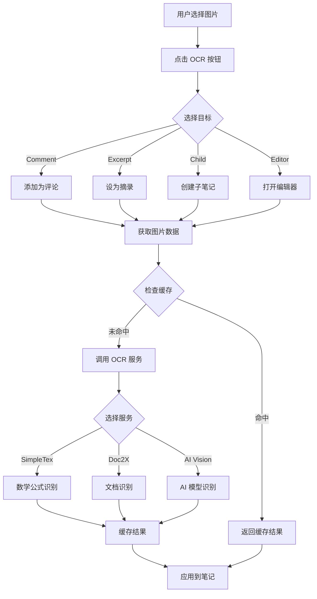

# MNOCR 插件深度分析

> 本文档对 MarginNote 4 的 OCR 插件进行深度技术分析，为插件开发教程提供详实的技术基础。
> 
> **插件版本**：v0.0.4.alpha0818  
> **代码规模**：约 2,000 行核心代码  
> **技术栈**：JavaScript + Objective-C Bridge + MNUtils Framework

## 1. 插件概述

### 1.1 核心功能
MNOCR 是 MarginNote 4 的智能 OCR（光学字符识别）插件，提供：
- **图片 OCR**：从笔记图片中提取文本和公式
- **PDF OCR**：全文档 OCR 识别和导出
- **多模型支持**：集成 40+ AI 视觉模型
- **数学公式识别**：专业的 LaTeX 公式提取
- **智能缓存**：OCR 结果缓冲和复用

### 1.2 技术特点
- **单控制器架构**：相比多控制器设计更简洁高效
- **深度框架集成**：充分利用 MNUtils 基础设施
- **浮动面板 UI**：创新的拖拽式交互设计
- **统一网络层**：标准化的多服务接口封装
- **智能配置管理**：加密存储和动态切换

## 2. 技术架构

### 2.1 整体架构

```
┌─────────────────────────────────────────────┐
│              MarginNote 4 App               │
├─────────────────────────────────────────────┤
│            MNUtils Framework                │
│  (MNUtil, MNNote, MNDocument, MNButton...)  │
├─────────────────────────────────────────────┤
│              MNOCR Plugin                   │
│                                            │
│  ┌──────────────────────────────────────┐ │
│  │         MNOCRClass (main.js)         │ │
│  │    - 生命周期管理                    │ │
│  │    - 窗口事件处理                    │ │
│  │    - 插件初始化                      │ │
│  └──────────────────────────────────────┘ │
│                    ↓                        │
│  ┌──────────────────────────────────────┐ │
│  │    ocrController (webviewController) │ │
│  │    - UI 控制器                       │ │
│  │    - 按钮管理                        │ │
│  │    - 手势识别                        │ │
│  └──────────────────────────────────────┘ │
│                    ↓                        │
│  ┌──────────────────────────────────────┐ │
│  │         ocrUtils (utils.js)          │ │
│  │    - 工具函数                        │ │
│  │    - 笔记操作                        │ │
│  │    - 错误处理                        │ │
│  └──────────────────────────────────────┘ │
│                    ↓                        │
│  ┌──────────────────────────────────────┐ │
│  │       ocrNetwork (utils.js)          │ │
│  │    - 网络请求                        │ │
│  │    - OCR 服务调用                    │ │
│  │    - 缓存管理                        │ │
│  └──────────────────────────────────────┘ │
│                    ↓                        │
│  ┌──────────────────────────────────────┐ │
│  │        ocrConfig (utils.js)          │ │
│  │    - 配置管理                        │ │
│  │    - API 密钥                        │ │
│  │    - 模型配置                        │ │
│  └──────────────────────────────────────┘ │
└─────────────────────────────────────────────┘
                    ↓
┌─────────────────────────────────────────────┐
│            External Services                │
│  - SimpleTex API (数学公式)                 │
│  - Doc2X API (文档 OCR)                     │
│  - OpenAI Vision API (GPT-4o 等)            │
│  - 其他 AI 模型服务                         │
└─────────────────────────────────────────────┘
```

### 2.2 文件结构

```
mnocr/
├── mnaddon.json        # 插件配置清单
├── main.js            # 插件主入口（161 行）
├── webviewController.js # UI 控制器（1,792 行）
├── utils.js           # 工具类集合（1,475 行）
├── CryptoJS.js        # 加密库
├── logo.png           # 插件图标
└── *.png              # UI 图标资源
```

## 3. 核心类深度分析

### 3.1 MNOCRClass - 插件主类（main.js:9-160）

#### 3.1.1 类定义结构
```javascript
JSB.defineClass('MNOCR : JSExtension', {
  // 实例方法
  sceneWillConnect(),      // 窗口连接
  notebookWillOpen(),      // 笔记本打开
  controllerWillLayoutSubviews(), // 布局更新
  queryAddonCommandStatus(), // 工具栏状态
  toggleAddon(),           // 切换显示
  
  // 类方法
  addonDidConnect(),       // 插件连接
  addonWillDisconnect()    // 插件断开
})
```

#### 3.1.2 生命周期管理

**窗口初始化流程**（行12-17）：
```javascript
sceneWillConnect: async function () {
  // 1. 检查 MNUtils 依赖
  if (!(await ocrUtils.checkMNUtil(false,0.1))) return
  
  // 2. 初始化插件
  self.init(mainPath)
  
  // 3. 设置首次使用标记
  self.isFirst = true
}
```

**笔记本打开处理**（行29-53）：
```javascript
notebookWillOpen: async function (notebookid) {
  // 1. 依赖检查
  if (!(await ocrUtils.checkMNUtil(false,0.1))) return
  
  // 2. 初始化控制器
  ocrUtils.checkOCRController()
  
  // 3. 根据学习模式设置显示
  if (ocrUtils.studyController.studyMode < 3) {
    // 文档/脑图模式：显示 OCR 面板
    ocrUtils.ocrController.view.frame = { x: 50, y: 100, width: 260, height: 345 }
  } else {
    // 复习模式：隐藏面板
    ocrUtils.ocrController.view.hidden = true
  }
}
```

#### 3.1.3 插件显示控制（行104-129）

```javascript
toggleAddon: function (sender) {
  // 1. 获取工具栏位置
  self.addonBar = sender.superview.superview
  
  // 2. 首次显示时智能定位
  if (self.isFirst) {
    let frame = buttonFrame.x < 100 
      ? {x:40, y:buttonFrame.y}      // 左侧显示
      : {x:buttonFrame.x-260, y:buttonFrame.y} // 右侧显示
  }
  
  // 3. 切换显示/隐藏动画
  if (ocrUtils.ocrController.view.hidden) {
    ocrUtils.ocrController.show(self.addonBar.frame)
  } else {
    ocrUtils.ocrController.hide(self.addonBar.frame)
  }
}
```

### 3.2 ocrController - UI 控制器（webviewController.js）

#### 3.2.1 控制器架构

```javascript
var ocrController = JSB.defineClass('ocrController : UIViewController', {
  // 生命周期方法
  viewDidLoad(),           // 视图加载
  viewWillLayoutSubviews(), // 布局更新
  
  // UI 交互方法
  changeSource(),          // 切换 OCR 源
  beginOCR(),             // 开始 OCR
  beginPDFOCR(),          // PDF OCR
  
  // 设置管理
  settingButtonTapped(),   // 设置面板
  savePrompt(),           // 保存提示词
  saveAction(),           // 保存动作配置
})
```

#### 3.2.2 视图初始化（行4-221）

**浮动面板设计**：
```javascript
viewDidLoad: function() {
  // 1. 设置阴影效果
  self.view.layer.shadowOffset = {width: 0, height: 0}
  self.view.layer.shadowRadius = 15
  self.view.layer.shadowOpacity = 0.5
  
  // 2. 圆角和半透明背景
  self.view.layer.cornerRadius = 15
  self.view.backgroundColor = UIColor.whiteColor().colorWithAlphaComponent(0.8)
  
  // 3. 创建功能按钮
  self.createOCRButtons()    // OCR 操作按钮
  self.createPDFButtons()    // PDF 操作按钮
  self.createSettingViews()  // 设置界面
  
  // 4. 添加手势识别
  self.setupGestureRecognizers()
}
```

#### 3.2.3 按钮系统（行52-143）

**OCR 操作按钮组**：
```javascript
// 评论按钮
self.OCRCommentButton = self.createButton("beginOCR:", "ocrView")
self.OCRCommentButton.action = "toComment"
MNButton.setTitle(self.OCRCommentButton, "OCR → Comment", 15, true)

// 选项按钮
self.OCROptionButton.action = "toOption"

// 摘录按钮
self.OCRExcerptButton.action = "toExcerpt"

// 子笔记按钮
self.OCRChildButton.action = "toChild"

// 编辑器按钮
self.OCREditorButton.action = "toEditor"

// 标题按钮
self.OCRTitleButton.action = "toTitle"
```

#### 3.2.4 手势识别系统（行147-159）

```javascript
// 为三个主要按钮添加拖动手势
self.moveGesture = new UIPanGestureRecognizer(self, "onMoveGesture:")
self.moveButton.addGestureRecognizer(self.moveGesture)

self.moveGesture2 = new UIPanGestureRecognizer(self, "onMoveGesture:")
self.settingButton.addGestureRecognizer(self.moveGesture2)

self.moveGesture3 = new UIPanGestureRecognizer(self, "onMoveGesture:")
self.closeButton.addGestureRecognizer(self.moveGesture3)
```

#### 3.2.5 手势处理（行702-798）

```javascript
onMoveGesture: function(gesture) {
  let state = gesture.state
  let translation = gesture.translationInView(self.view.superview)
  
  switch(state) {
    case 1: // 开始
      self.initialFrame = self.view.frame
      self.onAnimate = true
      break
      
    case 2: // 移动中
      let newFrame = {
        x: self.initialFrame.x + translation.x,
        y: self.initialFrame.y + translation.y,
        width: self.initialFrame.width,
        height: self.initialFrame.height
      }
      self.view.frame = newFrame
      break
      
    case 3: // 结束
      self.snapToEdge() // 边缘吸附
      self.onAnimate = false
      break
  }
}
```

#### 3.2.6 边缘吸附算法（行799-841）

```javascript
snapToEdge: function() {
  let frame = self.view.frame
  let studyFrame = MNUtil.studyView.bounds
  
  // 计算到各边缘的距离
  let distances = {
    left: frame.x,
    right: studyFrame.width - (frame.x + frame.width),
    top: frame.y,
    bottom: studyFrame.height - (frame.y + frame.height)
  }
  
  // 找到最近的边缘
  let minDistance = Math.min(...Object.values(distances))
  
  // 吸附动画
  UIView.animateWithDuration(0.3, () => {
    if (distances.left === minDistance) {
      frame.x = 10 // 左边缘
    } else if (distances.right === minDistance) {
      frame.x = studyFrame.width - frame.width - 10 // 右边缘
    }
    // ... 上下边缘处理
    self.view.frame = frame
  })
}
```

### 3.3 ocrUtils - 工具类（utils.js:11-504）

#### 3.3.1 类结构

```javascript
class ocrUtils {
  // 静态属性
  static pdfTranslate = false
  static errorLog = []
  static ocrController
  static mainPath
  
  // 核心方法
  static init(mainPath)           // 初始化
  static showHUD(message)          // 显示提示
  static addErrorLog(error)        // 错误记录
  static getFocusNote()            // 获取焦点笔记
  static getImageFromNote(note)    // 提取笔记图片
  static checkOCRController()      // 检查控制器
}
```

#### 3.3.2 错误处理系统（行51-65）

```javascript
static addErrorLog(error, source, info) {
  // 1. 显示错误提示
  MNUtil.showHUD("MN OCR Error (" + source + "): " + error)
  
  // 2. 记录错误日志
  let log = {
    error: error.toString(),
    source: source,
    time: (new Date(Date.now())).toString(),
    info: info
  }
  this.errorLog.push(log)
  
  // 3. 复制到剪贴板（方便调试）
  MNUtil.copyJSON(this.errorLog)
  
  // 4. 写入系统日志
  MNUtil.log({
    source: "MN OCR",
    message: source,
    level: "ERROR",
    detail: JSON.stringify(this.errorLog, null, 2)
  })
}
```

#### 3.3.3 图片提取逻辑（行226-253）

```javascript
static getImageFromNote(note, checkTextFirst = false) {
  // 1. 检查摘录图片
  if (note.excerptPic) {
    if (checkTextFirst && note.textFirst) {
      // 图片已转文本，跳过
    } else {
      return ocrUtils.getMediaByHash(note.excerptPic.paint)
    }
  }
  
  // 2. 遍历评论查找图片
  for (let comment of note.comments) {
    // PaintNote 类型（手写/图片）
    if (comment.type === 'PaintNote' && comment.paint) {
      return ocrUtils.getMediaByHash(comment.paint)
    }
    
    // LinkNote 类型（合并的图片）
    if (comment.type === "LinkNote" && comment.q_hpic?.paint) {
      return ocrUtils.getMediaByHash(comment.q_hpic.paint)
    }
  }
  
  return undefined
}
```

### 3.4 ocrNetwork - 网络层（utils.js:506-1358）

#### 3.4.1 网络架构

```javascript
class ocrNetwork {
  // 缓存管理
  static OCRBuffer = {}
  
  // 请求方法
  static initRequest(url, options)    // 初始化请求
  static sendRequest(request)         // 发送请求
  static fetch(url, options)          // 统一接口
  
  // OCR 服务
  static simpleTexOCR(imageData)      // SimpleTex
  static doc2xImgOCR(imageData)       // Doc2X 图片
  static doc2xPDFOCR(PDFData)         // Doc2X PDF
  static ChatGPTVision(imageData)     // AI 视觉
  
  // 缓存策略
  static OCR(imageData, source, buffer)
}
```

#### 3.4.2 统一 OCR 接口（行1174-1278）

```javascript
static async OCR(imageData, source = ocrConfig.getConfig("source"), buffer = true) {
  // 1. 生成缓存键
  let imageBase64 = imageData.base64Encoding()
  let strForMD5 = JSON.stringify(config) + imageBase64
  let MD5 = MNUtil.MD5(strForMD5)
  
  // 2. 检查缓存
  if (buffer && (MD5 in this.OCRBuffer)) {
    MNUtil.waitHUD("Read from buffer...")
    return this.OCRBuffer[MD5]
  }
  
  // 3. 调用对应服务
  let res = undefined
  switch (source) {
    case "Doc2X":
      res = await this.doc2xImgOCR(imageData)
      break
    case "SimpleTex":
      res = await this.simpleTexOCR(imageData)
      break
    case "GPT-4o":
    case "claude-3-5-sonnet":
    // ... 40+ 模型
      res = await this.ChatGPTVision(imageBase64, source)
      break
  }
  
  // 4. 缓存结果
  if (res) {
    this.OCRBuffer[MD5] = res
    MNUtil.log({
      source: "MN OCR",
      message: "✅ OCR By " + source,
      detail: res
    })
  }
  
  return res
}
```

#### 3.4.3 SimpleTex OCR 实现（行628-685）

```javascript
static async simpleTexOCR(imageData) {
  // 1. 获取 API 密钥
  let key = ocrConfig.getConfig("simpleTexApikey").trim()
  if (!key) {
    // 尝试从订阅系统获取
    if (this.isActivated()) {
      let res = await subscriptionNetwork.getKey("simpletex")
      key = ocrUtils.getRandomElement(res.keys)
    }
  }
  
  // 2. 构建请求
  const headers = { token: key }
  let url = "https://server.simpletex.cn/api/simpletex_ocr"
  
  // 3. 配置选项
  let config = {
    source: "SimpleTex",
    simpleTexRotation: ocrConfig.config.simpleTexRotation,
    simpleTexRecMode: ocrConfig.config.simpleTexRecMode
  }
  
  // 4. 发送请求
  const request = this.initOCRRequest(url, {headers}, imageData, config)
  let res = await this.sendRequest(request)
  
  // 5. 处理结果
  if (res.res.type === "formula") {
    return "$$" + res.res.info.trim() + "$$"  // LaTeX 公式
  }
  if (res.res.type === "doc") {
    return res.res.info.markdown.trim()       // Markdown 文档
  }
}
```

#### 3.4.4 AI 视觉模型集成（行717-779）

```javascript
static async ChatGPTVision(imageData, source = "GPT-4o") {
  // 1. 模型配置
  let modelConfig = ocrConfig.modelSource(source)
  let modelName = modelConfig.model
  let isFree = modelConfig.isFree
  
  // 2. API 密钥管理
  let key = isFree 
    ? 'sk-free-model-key'  // 免费模型密钥
    : subscriptionConfig.config.apikey  // 付费模型密钥
  
  // 3. 构建视觉请求
  let prompt = ocrConfig.getConfig("userPrompt")
  let imageUrl = "data:image/jpeg;base64," + imageData.base64Encoding()
  
  this.history = [
    {
      role: "system",
      content: prompt
    },
    {
      role: "user",
      content: [{
        type: "image_url",
        image_url: { url: imageUrl }
      }]
    }
  ]
  
  // 4. 发送请求
  let request = this.initRequestForChatGPT(key, url, modelName, 0.1)
  let res = await this.sendRequest(request)
  
  // 5. 格式化输出
  let ocrResult = res.choices[0].message.content
  return ocrResult
    .replace(/\$\$\n?/g, '$$$\n')       // 处理数学公式
    .replace(/\\\[\s*\n?|\s*\\\]\n?/g, '$$$\n')
    .replace(/```/g, '')                // 移除代码块标记
}
```

### 3.5 ocrConfig - 配置管理（utils.js:1360-1475）

#### 3.5.1 配置结构

```javascript
class ocrConfig {
  static defaultConfig = {
    // OCR 源配置
    source: "SimpleTex",           // 默认 OCR 源
    
    // API 密钥
    simpleTexApikey: "",          // SimpleTex
    doc2xApikey: "",              // Doc2X
    openaiApikey: "",             // OpenAI
    
    // SimpleTex 选项
    simpleTexRecMode: "auto",     // 识别模式
    simpleTexRotation: false,     // 自动旋转
    
    // Doc2X 选项
    imageCorrection: false,       // 图像校正
    pureEquation: false,          // 纯公式模式
    PDFOCR: false,               // PDF OCR 开关
    
    // AI 提示词
    userPrompt: `...`,           // 自定义提示
    
    // 动作配置
    action: {}                   // 后处理动作
  }
  
  static fileIds = {}            // PDF 文件 ID 缓存
}
```

#### 3.5.2 模型配置管理（行1398-1442）

```javascript
static modelSource(model) {
  let config = {
    // 免费模型
    "glm-4v-flash": {
      title: "GLM-4V Flash",
      model: "glm-4v-flash",
      isFree: true
    },
    "GPT-4.1-nano": {
      title: "GPT-4.1 Nano",
      model: "gpt-4.1-nano",
      isFree: true
    },
    
    // 付费模型
    "GPT-4o": {
      title: "GPT-4o",
      model: "gpt-4o-2024-08-06",
      isFree: false
    },
    "claude-3-5-sonnet": {
      title: "Claude-3.5 Sonnet",
      model: "claude-3-5-sonnet-20241022",
      isFree: false
    },
    // ... 40+ 模型配置
  }
  
  return config[model.toLowerCase()] || {
    title: "Unknown source " + model,
    isFree: false
  }
}
```

## 4. OCR 工作流程

### 4.1 单张图片 OCR 流程



### 4.2 PDF 文档 OCR 流程

```javascript
// webviewController.js:527-613
beginPDFOCR: async function(button) {
  // 1. 获取当前文档
  let currentDoc = MNUtil.currentDocController.document
  let docMd5 = currentDoc.docMd5
  
  // 2. 检查缓存
  if (ocrConfig.fileIds[docMd5]) {
    // 从服务器获取已处理结果
    return await this.getProcessedResult(docMd5)
  }
  
  // 3. 上传文档
  let fileData = MNUtil.getFile(currentDoc.fullPathFileName)
  let res = await ocrNetwork.doc2xPDFOCR(fileData, fileName, accessToken)
  
  // 4. 等待处理
  let uuid = res.data.uid
  do {
    let status = await this.checkStatus(uuid)
    MNUtil.waitHUD("Progress " + status.progress + "%")
  } while (!status.finished)
  
  // 5. 处理结果
  switch(button.action) {
    case "file":      // 保存到缓冲
      this.saveToBuffer(res)
      break
    case "export":    // 导出文件
      this.exportToFile(res)
      break
    case "copy":      // 复制到剪贴板
      this.copyToClipboard(res)
      break
    case "toEditor":  // 打开编辑器
      this.openInEditor(res)
      break
  }
}
```

## 5. UI 交互系统

### 5.1 浮动面板特性

#### 5.1.1 视觉效果
- **阴影效果**：15px 模糊半径，0.5 透明度
- **圆角设计**：15px 圆角半径
- **半透明背景**：白色 0.8 透明度
- **动画过渡**：0.3s 弹性动画

#### 5.1.2 交互设计
- **拖拽移动**：三个按钮均可拖动整个面板
- **边缘吸附**：自动吸附到最近的屏幕边缘
- **智能定位**：根据工具栏位置自动选择显示侧
- **展开/折叠**：设置面板的展开动画

### 5.2 按钮状态管理

```javascript
// webviewController.js:918-964
refreshView: function(source) {
  // 1. 更新标题显示
  let modelConfig = ocrConfig.modelSource(source)
  let title = modelConfig.isFree 
    ? "🆓 " + modelConfig.title 
    : "🤖 " + modelConfig.title
  self.moveButton.setTitleForState(title, 0)
  
  // 2. 切换界面模式
  if (source === "Doc2XPDF") {
    // PDF OCR 模式
    self.showPDFButtons()
    self.hideImageButtons()
  } else {
    // 图片 OCR 模式
    self.showImageButtons()
    self.hidePDFButtons()
  }
  
  // 3. 更新设置选项
  this.updateSettingOptions(source)
}
```

### 5.3 设置面板

#### 5.3.1 API 密钥管理
```javascript
// 粘贴密钥
pasteApikey: function() {
  let apikey = ocrUtils.clipboardText().trim()
  self.apikeyInput.text = apikey
  
  // 根据当前源保存
  switch (ocrConfig.getConfig("source")) {
    case "Doc2X":
      ocrConfig.config.doc2xApikey = apikey
      break
    case "SimpleTex":
      ocrConfig.config.simpleTexApikey = apikey
      break
  }
  ocrConfig.save()
}
```

#### 5.3.2 提示词编辑器
- **实时编辑**：UITextView 支持多行输入
- **保存/重置**：独立的保存和重置按钮
- **默认模板**：预设的专业提示词模板

## 6. 错误处理机制

### 6.1 多层错误捕获

```javascript
// 三层错误处理架构

// 第一层：方法级 try-catch
beginOCR: async function(button) {
  try {
    // OCR 处理逻辑
  } catch (error) {
    ocrUtils.addErrorLog(error, "beginOCR")
  }
}

// 第二层：网络请求错误
sendRequest: function(request) {
  NSURLConnection.sendAsynchronousRequest(request, (res, data, err) => {
    if (err.localizedDescription) {
      MNUtil.confirm("MN OCR Error", err.localizedDescription)
      resolve({success: false})
    }
  })
}

// 第三层：全局错误日志
static addErrorLog(error, source) {
  // 记录、显示、复制错误信息
  this.errorLog.push({error, source, time})
  MNUtil.copyJSON(this.errorLog)
}
```

### 6.2 用户友好的错误提示

- **HUD 提示**：轻量级的错误提示
- **确认对话框**：严重错误的详细说明
- **剪贴板复制**：方便用户反馈问题
- **日志持久化**：错误历史记录

## 7. 性能优化策略

### 7.1 缓存机制

#### 7.1.1 内存缓存
```javascript
// MD5 作为缓存键
let MD5 = MNUtil.MD5(JSON.stringify(config) + imageBase64)

// 缓存命中直接返回
if (MD5 in this.OCRBuffer) {
  return this.OCRBuffer[MD5]
}

// 缓存未命中则请求并存储
let res = await this.requestOCR(imageData)
this.OCRBuffer[MD5] = res
```

#### 7.1.2 文件缓存
```javascript
// PDF OCR 结果持久化
let docMd5 = currentDoc.docMd5
let cachePath = MNUtil.dbFolder + "/" + docMd5 + ".json"

// 检查文件缓存
if (MNUtil.isfileExists(cachePath)) {
  return MNUtil.readJSON(cachePath)
}
```

### 7.2 批量操作优化

```javascript
// 使用 undoGrouping 批量修改
ocrUtils.undoGrouping(() => {
  // 批量添加 OCR 结果到多个笔记
  notes.forEach(note => {
    note.appendTextComment(ocrResult)
  })
})
```

### 7.3 延迟加载

```javascript
// 控制器懒加载
static checkOCRController() {
  if (!this.ocrController) {
    this.ocrController = ocrController.new()
    this.ocrController.view.hidden = true
  }
}
```

## 8. 技术亮点

### 8.1 创新设计
1. **浮动面板 UI**：独特的拖拽式交互设计
2. **边缘吸附算法**：智能的窗口定位系统
3. **多模型集成**：统一接口支持 40+ AI 模型
4. **智能缓存**：多级缓存提升响应速度

### 8.2 工程实践
1. **单控制器架构**：相比多控制器更简洁高效
2. **深度框架集成**：充分利用 MNUtils 基础设施
3. **错误处理系统**：完善的错误捕获和日志记录
4. **配置管理**：灵活的配置系统和加密存储

### 8.3 用户体验
1. **学习模式感知**：根据模式自动显示/隐藏
2. **免费模型支持**：提供多个免费 AI 模型选项
3. **实时进度反馈**：PDF OCR 的进度显示
4. **快捷操作**：多种 OCR 目标选择

## 9. 开发指南

### 9.1 环境准备

```bash
# 1. 确保安装 MNUtils 插件
# 2. 克隆项目
git clone [repository]

# 3. 进入插件目录
cd mnocr/mnocr

# 4. 打包插件
mnaddon4 build .

# 5. 安装到 MarginNote 4
# 将生成的 .mnaddon 文件拖入应用
```

### 9.2 调试技巧

#### 9.2.1 日志调试
```javascript
// 使用 MNUtil.log 记录日志
MNUtil.log({
  source: "MN OCR",
  message: "调试信息",
  level: "INFO",
  detail: JSON.stringify(data)
})

// 复制对象到剪贴板
MNUtil.copyJSON(complexObject)
```

#### 9.2.2 错误追踪
```javascript
// 查看错误历史
ocrUtils.errorLog

// 错误自动复制到剪贴板
// 可直接粘贴查看详细信息
```

#### 9.2.3 UI 调试
```javascript
// 显示临时消息
MNUtil.showHUD("Debug: " + value)

// 检查视图层级
MNUtil.isDescendantOfStudyView(view)

// 帧调试
console.log(ocrController.currentFrame)
```

### 9.3 扩展开发

#### 9.3.1 添加新的 OCR 服务
```javascript
// 1. 在 ocrNetwork 中添加服务方法
static async newServiceOCR(imageData) {
  // 实现 OCR 逻辑
}

// 2. 在 OCR 统一接口中添加分支
case "NewService":
  res = await this.newServiceOCR(imageData)
  break

// 3. 在配置中添加模型信息
"new-model": {
  title: "New Model",
  model: "new-model-api",
  isFree: false
}
```

#### 9.3.2 自定义 UI 按钮
```javascript
// 1. 创建按钮
self.customButton = self.createButton("customAction:", "ocrView")
MNButton.setTitle(self.customButton, "Custom OCR", 15, true)

// 2. 设置布局
self.customButton.frame = {x: 15, y: 290, width: 230, height: 33}

// 3. 实现动作
customAction: function(button) {
  // 自定义逻辑
}
```

## 10. 最佳实践

### 10.1 代码规范
1. **命名规范**：使用驼峰命名，类名大写开头
2. **注释规范**：关键逻辑添加中文注释
3. **错误处理**：所有异步操作包装 try-catch
4. **日志记录**：重要操作记录日志

### 10.2 性能建议
1. **使用缓存**：重复 OCR 请求应使用缓存
2. **批量操作**：多个修改使用 undoGrouping
3. **延迟加载**：非关键组件延迟初始化
4. **内存管理**：及时释放大对象引用

### 10.3 用户体验
1. **进度提示**：长时间操作显示进度
2. **错误反馈**：友好的错误提示信息
3. **默认配置**：提供合理的默认值
4. **快捷操作**：减少用户操作步骤

## 11. 技术总结

MNOCR 插件展示了 MarginNote 4 插件开发的最佳实践：

### 11.1 架构设计
- **简洁高效**：单控制器架构降低复杂度
- **模块化**：清晰的类职责划分
- **可扩展**：易于添加新的 OCR 服务

### 11.2 技术实现
- **深度集成**：充分利用 MNUtils 框架
- **统一接口**：标准化的服务调用
- **智能缓存**：多级缓存提升性能

### 11.3 用户价值
- **功能丰富**：支持多种 OCR 场景
- **操作便捷**：直观的浮动面板设计
- **稳定可靠**：完善的错误处理机制

## 12. 未来展望

### 12.1 功能增强
- 批量 OCR 处理
- OCR 结果编辑器
- 自定义后处理脚本
- 更多 AI 模型支持

### 12.2 性能优化
- 并发请求处理
- 增量 OCR 识别
- 本地模型支持
- 云端结果同步

### 12.3 用户体验
- 手势快捷操作
- OCR 历史记录
- 智能纠错建议
- 多语言支持

---

*本文档基于 MNOCR v0.0.4.alpha0818 版本分析，作为 MarginNote 4 插件开发教程的技术基础。*