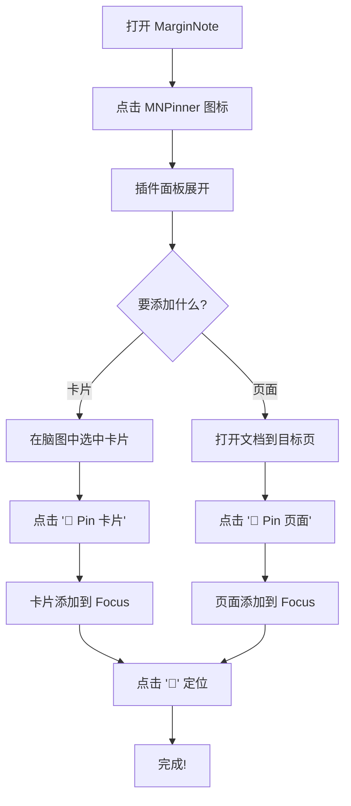
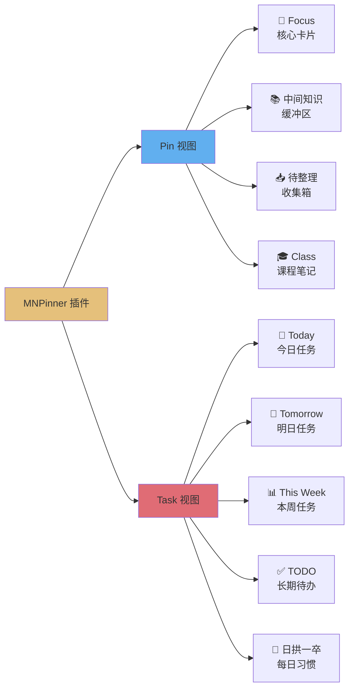
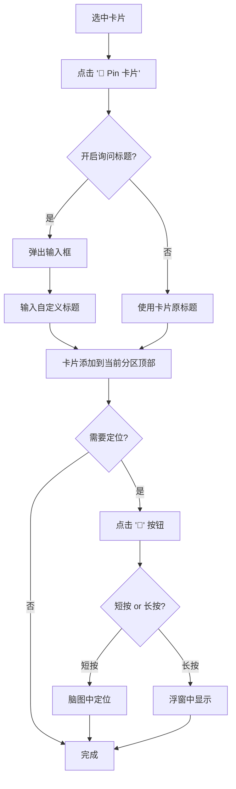
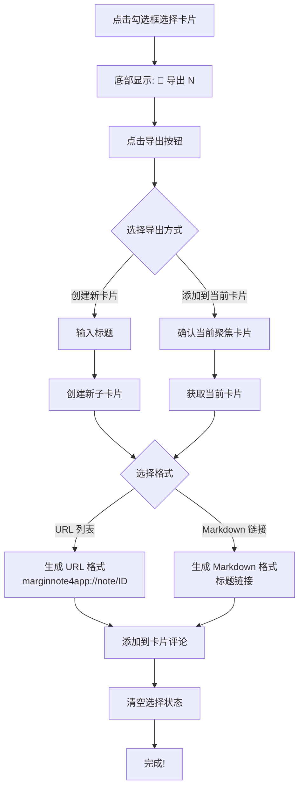
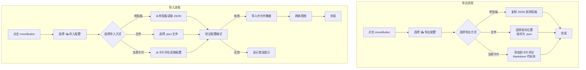
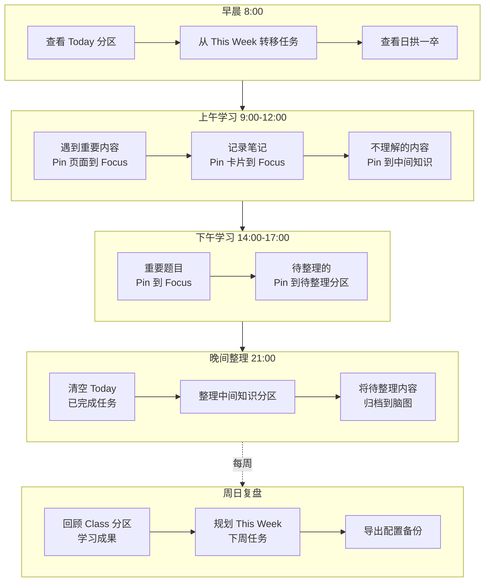
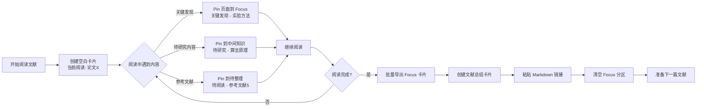
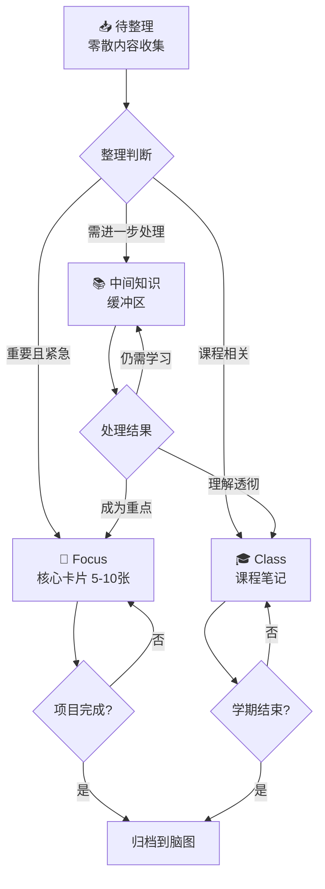
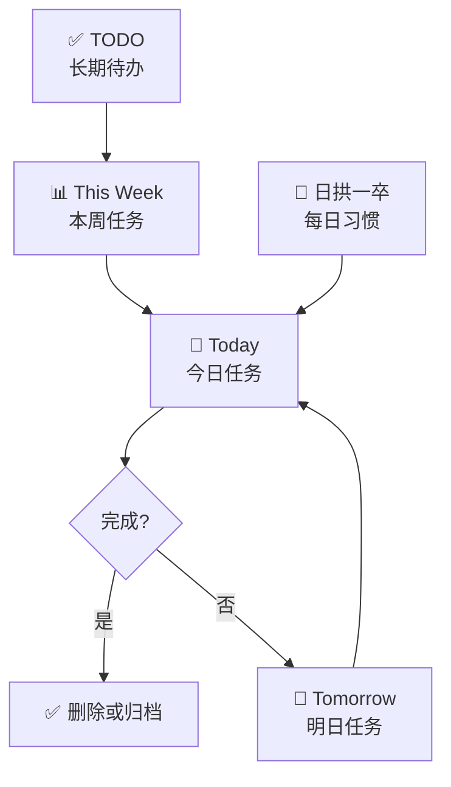
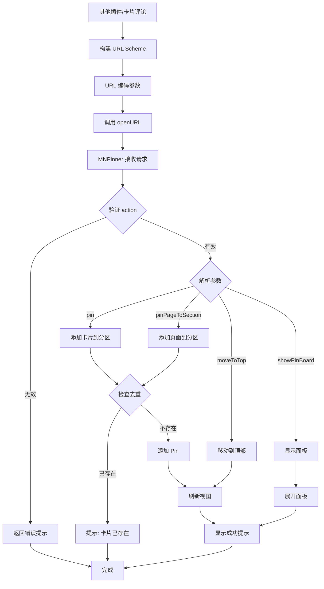

# MNPinner 用户使用手册

**版本**: v2.1
**作者**: Kangwei Xia
**适用于**: MarginNote 4 (3.6.11+)
**文档更新日期**: 2025-11-11

---

## 目录

1. [插件简介](#插件简介)
2. [快速上手](#快速上手)
3. [核心功能详解](#核心功能详解)
4. [进阶功能](#进阶功能)
5. [实用工作流](#实用工作流)
6. [使用技巧](#使用技巧)
7. [常见问题](#常见问题)
8. [跨插件通信](#跨插件通信)

---

## 插件简介

### MNPinner 是什么？

**MNPinner** 是 MarginNote 4 的浮窗插件，为你提供一个"置顶面板"，让你可以：

- **快速访问重要卡片**：将常用卡片固定在面板中，一键定位
- **标记重要页面**：收藏文档中的关键页面，随时跳转
- **管理每日任务**：通过 Task 视图管理今日、本周的任务
- **灵活分类**：支持多个分区（Focus、中间知识、待整理等），满足不同场景

### 适合谁使用？

- **学生**：管理课程笔记、作业任务、复习材料
- **研究者**：组织文献阅读进度、标记关键段落
- **知识工作者**：整理待处理的知识碎片、管理项目卡片

### 核心价值

不需要在脑图中反复搜索卡片，也不需要记住文档的页码——把重要内容"Pin"到面板中，随时访问。

---

## 快速上手

### 快速开始流程



### 第一步：打开插件

1. 在 MarginNote 中打开任意学习集
2. 点击插件栏的 **MNPinner 图标**（📌）
3. 插件面板从图标位置淡入展开，默认显示 **Focus** 分区

### 第二步：Pin 你的第一张卡片

1. 在脑图中 **选中一张卡片**
2. 点击面板底部的 **"📌 Pin 卡片"** 按钮
3. 卡片立即出现在 Focus 分区的顶部
4. 点击卡片旁边的 **"📍"** 按钮，立刻在脑图中定位到该卡片

### 第三步：Pin 文档页面

1. 打开一个 PDF 文档，浏览到某一页
2. 点击面板底部的 **"📄 Pin 页面"** 按钮
3. 系统自动生成标题（如 "文档名 - 第5页"）
4. 页面被添加到当前分区
5. 点击 **"📍"** 按钮，自动打开文档并跳转到该页

### 第四步：切换分区

- 点击面板顶部的标签按钮（如 **"📚 中间知识"**、**"📥 待整理"**）
- 面板内容切换到对应分区

### 第五步：切换视图

1. 点击底部工具栏的 **"📌 视图"** 按钮
2. 选择 **Task** 视图
3. 查看 Today、Tomorrow、This Week 等任务分区

---

## 核心功能详解

### 视图架构总览



### 3.1 Pin 视图

Pin 视图包含 **5 个预设分区**，用于管理知识卡片：

#### 分区详解

| 分区名称 | 图标 | 用途说明 |
|---------|------|---------|
| **Focus** | 📌 | 存放当前正在研究的核心卡片（建议 5-10 张） |
| **中间知识** | 📚 | 临时存放待进一步处理的知识（缓冲区） |
| **待整理** | 📥 | 需要整理的零散内容（定期清空） |
| **Class** | 🎓 | 课程相关的重要卡片（按课程分类） |

#### 使用建议

- **Focus**：严格控制数量，只放最重要的卡片
- **中间知识**：作为"收件箱"，每天或每周整理一次
- **待整理**：临时存放区，定期清空并整理到脑图中
- **Class**：按课程建立子卡片，每门课程一个分支

---

### 3.2 Task 视图

Task 视图包含 **5 个预设分区**，用于管理任务：

#### 分区详解

| 分区名称 | 图标 | 用途说明 |
|---------|------|---------|
| **Today** | 📅 | 今天必须完成的任务 |
| **Tomorrow** | 📆 | 明天计划处理的任务 |
| **This Week** | 📊 | 本周内要完成的任务 |
| **TODO** | ✅ | 长期待办事项（无明确截止日期） |
| **日拱一卒** | 🏃 | 每日坚持的习惯任务（如每日复习、背单词） |

#### 使用建议

- **Today**：早晨计划时添加，晚上清空已完成的
- **This Week**：周日整理一次，规划本周任务
- **日拱一卒**：放入需要每天坚持的小任务（不超过 5 个）

---

### 3.3 基础操作

#### Pin 卡片



**方式一：快捷 Pin**
1. 在脑图中选中卡片
2. 点击 **"📌 Pin 卡片"**
3. 卡片立即添加到当前分区顶部

**方式二：自定义标题 Pin**
1. 在设置中开启 **"Pin 卡片时询问标题"**
2. Pin 卡片时会弹出输入框
3. 输入自定义标题（如 "重要：牛顿第二定律"）

#### Pin 页面

**方式一：默认标题**
1. 打开文档，浏览到目标页面
2. 点击 **"📄 Pin 页面"**
3. 系统自动生成标题（如 "高等数学 - 第23页"）

**方式二：使用预设短语**
1. 在设置中添加预设短语（如 "重要章节"、"课后习题"）
2. Pin 页面时选择预设，并可拼接自定义内容
3. 最终标题如 "重要章节 - 微分方程"

#### 定位与跳转

**卡片定位**
- **短按 "📍" 按钮**：在脑图中定位卡片（切换到脑图视图）
- **长按 "📍" 按钮**：在浮窗中显示卡片（不切换主视图，适合快速查看）

**页面跳转**
- **短按 "📍" 按钮**：自动打开对应文档，跳转到指定页面，并切换到文档+脑图分割视图

#### 管理 Pin

**点击 Pin 标题**，弹出操作菜单：

| 操作 | 说明 |
|------|------|
| **↔️ 转移到...** | 将 Pin 移动到其他分区 |
| **✏️ 重命名** | 修改 Pin 显示的标题 |
| **🔄 更新为当前卡片** | 将 Pin 的 ID 替换为当前聚焦卡片的 ID |
| **🗑️ 删除** | 从分区中删除该 Pin |

**调整顺序**

每个 Pin 右侧有上下箭头按钮：
- **短按上移/下移**：向上或向下移动一位
- **长按上移/下移**：直接置顶或置底（无需多次点击）

#### 创建空白卡片

1. 点击底部的 **"➕ 创建空白卡片"**
2. 输入标题（如 "待补充：量子力学笔记"）
3. 空白卡片添加到分区中
4. 点击 **"📍"** 按钮时，系统会自动创建一个真实的子卡片，并更新 Pin 的 ID

---

### 3.4 面板操作

#### 移动面板

- 按住顶部的 **"moveButton"**（拖动手柄）
- 拖动到屏幕任意位置

#### 调整大小

- 拖动右下角的 **"resizeButton"**
- 面板大小自由调整

#### 迷你模式

**进入迷你模式**：
1. 将面板拖动到屏幕 **左边缘** 或 **右边缘**
2. 面板自动缩小为一个小按钮

**退出迷你模式**：
- 点击迷你按钮
- 或向屏幕内侧拖动

#### 关闭面板

- 点击右上角的 **"✕"** 按钮
- 或点击插件栏的 MNPinner 图标

---

## 进阶功能

### 4.1 批量操作

#### 批量导出流程图



#### 多选卡片

1. 点击 Pin 左侧的 **勾选框** 选择/取消选择
2. 底部显示选中数量（如 **"🔗 导出 (3)"**）
3. 可跨分区选择

#### 批量导出 URL 列表

1. 选中多张卡片
2. 点击 **"🔗 导出 (N)"** 按钮
3. 选择导出方式：
   - **"✅ 创建新卡片"**：创建一个新的子卡片，并在评论中添加 URL 列表
   - **"📌 添加到当前卡片"**：将 URL 添加到当前聚焦卡片的评论中
4. 输入标题（可选，如 "重要卡片集合"）

**导出格式示例**：
```
marginnote4app://note/NOTE_ID_1
marginnote4app://note/NOTE_ID_2
marginnote4app://note/NOTE_ID_3
```

点击 URL 可直接跳转到对应卡片。

#### 批量导出 Markdown 链接

1. 选中多张卡片
2. 点击 **"📝 导出为 Markdown"**（如有此选项）
3. 选择导出方式（同上）

**导出格式示例**：
```markdown
1. [卡片标题1](marginnote4app://note/NOTE_ID_1)
2. [卡片标题2](marginnote4app://note/NOTE_ID_2)
3. [卡片标题3](marginnote4app://note/NOTE_ID_3)
```

可粘贴到 Obsidian、Notion 等工具中使用。

---

### 4.2 配置管理

#### 配置管理流程图



#### 导出配置

**方式一：导出到剪贴板**
1. 点击顶部 **"moveButton"**
2. 选择 **"📤 导出配置"**
3. 选择 **"📋 导出到剪贴板"**
4. JSON 格式的配置已复制到剪贴板

**方式二：导出到文件**
1. 选择 **"📁 导出到文件"**
2. 选择保存位置
3. 保存为 `.json` 文件

**方式三：导出到当前卡片**
1. 在脑图中选中一张卡片
2. 选择 **"📌 导出到当前卡片"**
3. 配置以 Markdown 代码块形式添加到卡片评论中

#### 导入配置

**方式一：从剪贴板导入**
1. 复制配置 JSON 到剪贴板
2. 点击 **"📥 导入配置"**
3. 选择 **"📋 从剪贴板导入"**

**方式二：从文件导入**
1. 选择 **"📁 从文件导入"**
2. 选择 `.json` 配置文件

**方式三：从当前卡片导入**
1. 在脑图中选中包含配置的卡片
2. 选择 **"📌 从当前卡片导入"**
3. 系统自动识别评论中的配置代码块

#### 配置内容说明

配置包含：
- **所有分区的 Pin 数据**（卡片 ID、标题、页面信息等）
- **插件设置**（默认视图、是否询问标题等）
- **预设短语列表**

---

### 4.3 预设短语管理

预设短语用于快速填写页面标题。

#### 添加预设

1. 点击顶部 **"moveButton"**
2. 选择 **"✏️ 管理预设短语"**
3. 点击 **"➕ 添加新预设"**
4. 输入短语（如 "重要章节"、"课后习题"、"复习要点"）

#### 使用预设

1. Pin 页面时，弹出预设短语列表
2. 选择一个预设
3. 可继续输入拼接内容（如选择 "重要章节" 后输入 " - 微分方程"）
4. 最终标题为 "重要章节 - 微分方程"

#### 管理预设

- **编辑**：点击预设，修改内容
- **删除**：长按预设，删除

---

### 4.4 偏好设置

点击顶部 **"moveButton"** → **"⚙️ 偏好设置"**

#### 启动行为

**选项一：记住上次视图（推荐）**
- 下次打开插件时，显示上次关闭前的视图和分区
- 适合多场景切换使用

**选项二：固定默认视图**
- 每次打开插件时，始终显示预设的默认视图和分区
- 适合固定工作流

#### 默认视图设置（固定模式下生效）

- **默认视图**：选择 Pin / Task / 自定义
- **默认分区**：选择该视图下的某个分区（如 Focus、Today）

#### Pin 行为设置

- **Pin 卡片时询问标题**：
  - ✅ 开启：每次 Pin 卡片都弹出输入框
  - ☐ 关闭：直接使用卡片标题

- **Pin 页面时询问标题**：
  - ✅ 开启：每次 Pin 页面都可选择预设或自定义标题
  - ☐ 关闭：直接使用默认标题（文档名 - 第X页）

#### 推荐配置

- 启动行为：**记住上次视图** ✅
- Pin 卡片询问标题：**关闭** ☐（加快操作速度）
- Pin 页面询问标题：**开启** ✅（方便分类页面）

---

## 实用工作流

### 5.1 学生场景：课程学习管理

#### 每日学习流程



**早晨计划（5分钟）**
1. 打开 MNPinner，切换到 **Task 视图 → Today**
2. 从 **This Week** 分区拖动今天要完成的任务到 **Today**
3. 在 **日拱一卒** 查看每日复习任务

**课程学习（随时）**
1. 阅读 PDF 教材时，遇到重要内容：
   - Pin 页面到 **Focus** 分区（如 "重要章节 - 微分方程"）
2. 做笔记时，创建重要卡片：
   - Pin 卡片到 **Focus** 分区
3. 遇到需要进一步理解的内容：
   - Pin 到 **中间知识** 分区

**晚间整理（10分钟）**
1. 清空 **Today** 分区已完成的任务
2. 将 **中间知识** 分区的卡片整理：
   - 理解透彻的：转移到 **Class** 分区或删除
   - 仍需学习的：保留在 **中间知识**
3. 将 **待整理** 分区的零散内容整理到脑图中

**周日复盘（30分钟）**
1. 回顾本周学习成果（查看 **Class** 分区）
2. 规划下周任务（在 **This Week** 中添加）
3. 导出配置到文件备份

---

### 5.2 研究者场景：文献阅读管理

#### 文献阅读流程



**阅读前准备**
1. 在 **Focus** 分区创建空白卡片 "当前阅读：[论文标题]"
2. 在 **TODO** 分区添加本周计划阅读的文献

**阅读过程**
1. 遇到关键段落：
   - Pin 页面到 **Focus**，标题 "关键发现 - 实验方法"
2. 需要深入理解的内容：
   - Pin 到 **中间知识**，标题 "待研究 - 算法原理"
3. 参考文献：
   - Pin 到 **待整理**，标题 "待阅读 - 参考文献[5]"

**阅读后整理**
1. 将 **Focus** 分区的关键卡片批量导出为 Markdown 链接
2. 创建文献总结卡片，粘贴链接列表
3. 清空 **Focus** 分区，准备下一篇文献

---

### 5.3 知识工作者场景：项目管理

#### 项目启动

1. 在 **Focus** 创建空白卡片 "项目：[项目名称]"
2. 在 **This Week** 添加本周里程碑任务
3. 在 **TODO** 添加长期目标

#### 日常工作

1. 处理项目相关卡片：
   - 优先级高的：Pin 到 **Today**
   - 需要跟进的：Pin 到 **Tomorrow**
2. 收集零散想法：
   - Pin 到 **待整理**，定期归档

#### 项目复盘

1. 批量选择项目相关卡片
2. 导出为 URL 列表
3. 创建项目总结卡片，记录关键成果

---

## 使用技巧

### 6.1 操作技巧

#### 快捷操作

- **长按上移/下移**：直接置顶/置底（省去多次点击）
- **长按定位按钮**：在浮窗查看卡片（不切换主视图）
- **拖动到边缘**：快速进入迷你模式（节省屏幕空间）

#### 批量处理

- **多选 + 导出**：快速生成卡片链接集合
- **导出 Markdown**：粘贴到 Obsidian、Notion 等工具
- **批量转移**：通过配置导出/导入实现跨分区批量移动

#### 配置管理

- **定期备份**：每周导出配置到文件
- **多设备同步**：通过导入/导出在不同设备间同步配置
- **快照保存**：使用"导出到当前卡片"在学习集中保存配置快照

---

### 6.2 分区使用建议

#### 分区流转策略图

**Pin 视图流转策略：**



**Task 视图流转策略：**



#### Focus 分区

- **严格限制数量**：不超过 10 张
- **定期清理**：每周整理一次，删除不再重要的
- **用于当前任务**：只放正在进行的项目/课程相关卡片

#### 中间知识分区

- **作为缓冲区**：临时存放待处理的内容
- **每日整理**：每天抽 5 分钟整理
- **快速分流**：理解的转移到其他分区，不理解的保留

#### 待整理分区

- **零散内容收集箱**：随时添加，定期清空
- **每周清空一次**：将内容整理到脑图中
- **避免积压**：不要让待整理超过 20 项

---

### 6.3 效率提升技巧

#### 预设短语优化

- 按使用频率排序（常用的放前面）
- 使用简短的关键词（如 "重要"、"复习"、"TODO"）
- 预留拼接空间（预设 + 自定义内容）

#### 视图切换策略

- **早晨**：Task 视图 → Today 分区（规划一天）
- **学习时**：Pin 视图 → Focus 分区（专注核心内容）
- **晚间**：Task 视图 → 日拱一卒 分区（每日习惯）

#### 批量导出妙用

1. **创建学习地图**：
   - 批量选择某主题的卡片
   - 导出为 Markdown 链接
   - 创建"知识地图"卡片，粘贴链接

2. **每日复习清单**：
   - 批量选择需要复习的卡片
   - 导出为 URL 列表
   - 每天打开清单逐个复习

3. **项目资料汇总**：
   - 批量选择项目相关卡片
   - 导出到项目主卡片
   - 方便追踪所有相关资料

---

## 常见问题

### 7.1 数据与安全

**Q: Pin 的数据存储在哪里？**
A: 数据存储在 MarginNote 的 NSUserDefaults 中（本地存储）。

**Q: 卸载插件会丢失数据吗？**
A: 是的。建议定期导出配置到文件备份。

**Q: 如何在多设备间同步配置？**
A: 在设备 A 导出配置到文件 → 通过云盘同步 → 在设备 B 导入配置。

---

### 7.2 操作问题

**Q: 为什么点击定位按钮没反应？**
A: 可能原因：
1. 卡片已被删除（从脑图中删除后，Pin 仍保留）
2. 卡片在其他学习集中（需要先打开对应学习集）

解决方法：删除该 Pin 或更新为当前卡片。

**Q: 为什么 Pin 页面后跳转页码不对？**
A: 可能原因：
1. PDF 重新导入后 MD5 变化（系统识别为新文档）
2. PDF 的逻辑页码与物理页码不一致

解决方法：重新 Pin 该页面。

**Q: 如何批量删除 Pin？**
A:
1. 方法一：点击分区右侧的 "🗑️ 清空" 按钮（清空整个分区）
2. 方法二：导出配置 → 手动编辑 JSON → 导入配置

---

### 7.3 性能问题

**Q: 分区内容太多导致滚动卡顿怎么办？**
A: 建议单个分区不超过 100 个 Pin。定期清理不再需要的 Pin。

**Q: 如何快速清理大量 Pin？**
A: 点击分区右侧的 "🗑️ 清空" 按钮，一键清空整个分区。

---

### 7.4 其他问题

**Q: 可以自定义分区吗？**
A: MNPinner v2.1 支持自定义分区（custom1-custom5），但需要在配置中启用。当前版本默认未开放。

**Q: 空白卡片有什么用？**
A: 用于快速占位，点击定位后自动创建真实子卡片。适合临时记录待补充的内容。

**Q: Pin 数据会影响 MarginNote 性能吗？**
A: 不会。Pin 数据是独立存储的，不会影响 MarginNote 或学习集的性能。

---

## 跨插件通信

### 8.1 URL Scheme 基础

MNPinner 支持通过 URL Scheme 接收其他插件的调用，实现跨插件协作。

#### URL Scheme 调用流程



#### 基础格式

```
marginnote4app://addon/mnpinner?action=ACTION&param1=value1&param2=value2
```

#### 参数编码

中文和特殊字符必须使用 `encodeURIComponent` 编码：

```javascript
let title = "重要笔记"
let encodedTitle = encodeURIComponent(title)  // "%E9%87%8D%E8%A6%81%E7%AC%94%E8%AE%B0"
```

---

### 8.2 支持的 Actions

#### 1. pin - 通用添加卡片（推荐）

添加卡片到指定分区。

**格式**：
```
marginnote4app://addon/mnpinner?action=pin&id=NOTE123&title=重要笔记&section=focus&position=top
```

**参数说明**：
- `id` (必需)：卡片 ID（需 URL 编码）
- `title` (可选)：显示标题（需 URL 编码，不填则使用卡片原标题）
- `section` (可选)：分区名称（默认 "midway"）
  - 可选值：`focus`、`midway`、`toOrganize`、`class`、`taskToday` 等
- `position` (可选)：插入位置（默认 "bottom"）
  - 可选值：`top`（顶部）、`bottom`（底部）、数字索引

**示例**：
```
// 添加到 Focus 顶部
marginnote4app://addon/mnpinner?action=pin&id=ABC123&section=focus&position=top

// 添加到 Today，自定义标题
marginnote4app://addon/mnpinner?action=pin&id=XYZ789&title=%E4%BB%8A%E6%97%A5%E4%BB%BB%E5%8A%A1&section=taskToday
```

---

#### 2. pinCardToSection - 添加 Card 到指定分区

功能与 `pin` 相同，参数略有不同。

**格式**：
```
marginnote4app://addon/mnpinner?action=pinCardToSection&id=NOTE123&section=focus&position=top
```

**参数说明**：
- `id` / `noteId` (必需)：卡片 ID
- `section` (可选)：分区（默认 "midway"）
- `position` (可选)：位置（默认 "top"）
- `title` (可选)：自定义标题

---

#### 3. pinPageToSection - 添加 Page 到指定分区

添加文档页面到指定分区。

**格式**：
```
marginnote4app://addon/mnpinner?action=pinPageToSection&docMd5=ABC123&pageIndex=5&section=focus
```

**参数说明**：
- `docMd5` / `docmd5` (必需)：文档 MD5
- `pageIndex` / `pageindex` (必需)：页码（从 0 开始）
- `section` (可选)：分区（默认 "midway"）
- `position` (可选)：位置（默认 "top"）
- `title` (可选)：自定义标题
- `note` (可选)：备注

**示例**：
```
// Pin 文档第 6 页到 Focus
marginnote4app://addon/mnpinner?action=pinPageToSection&docMd5=ABC123&pageIndex=5&section=focus&title=%E9%87%8D%E8%A6%81%E7%AB%A0%E8%8A%82
```

---

#### 4. moveToTop / moveToBottom - 移动位置

将已存在的 Pin 移到顶部或底部。

**格式**：
```
marginnote4app://addon/mnpinner?action=moveToTop&id=NOTE123&section=focus
marginnote4app://addon/mnpinner?action=moveToBottom&id=NOTE123&section=focus
```

**参数说明**：
- `id` (必需)：卡片 ID
- `section` (必需)：分区名称

---

#### 5. showPinBoard - 显示面板

打开 MNPinner 面板。

**格式**：
```
marginnote4app://addon/mnpinner?action=showPinBoard
```

无参数。

---

### 8.3 使用示例

#### 从其他插件调用

假设你在开发一个插件，想要将当前卡片添加到 MNPinner 的 Focus 分区：

```javascript
let noteId = MNNote.getFocusNote().noteId
let title = "重要卡片"

// 构建 URL
let encodedId = encodeURIComponent(noteId)
let encodedTitle = encodeURIComponent(title)
let url = `marginnote4app://addon/mnpinner?action=pin&id=${encodedId}&title=${encodedTitle}&section=focus&position=top`

// 调用 URL Scheme
Application.sharedInstance().openURL(NSURL.URLWithString(url))
```

#### 从卡片评论调用

在卡片评论中添加 URL，点击后自动 Pin：

```
点击链接将此卡片添加到 Focus：
marginnote4app://addon/mnpinner?action=pin&id=ABC123&section=focus
```

---

### 8.4 注意事项

1. **参数编码**：所有中文和特殊字符必须 URL 编码
2. **分区验证**：无效的 `section` 参数会返回错误提示
3. **去重检查**：重复添加相同 ID 的卡片会提示"卡片已存在"
4. **页码索引**：`pageIndex` 从 0 开始（第 1 页 = pageIndex 0）

---

## 结语

MNPinner 是一个强大而灵活的卡片管理工具，希望这份手册能帮助你充分利用它的功能。

### 推荐使用习惯

1. **每天 5 分钟整理**：早晨规划，晚间复盘
2. **定期备份配置**：每周导出一次
3. **严格控制数量**：Focus 不超过 10 张，Today 不超过 5 个任务
4. **善用批量导出**：创建知识地图和复习清单

### 获取帮助

- **GitHub 仓库**：[MN-Addon](https://github.com/xkwxdyy/MN-Addons)
- **问题反馈**：通过 GitHub Issues 提交
- **插件作者**：Kangwei Xia

---
